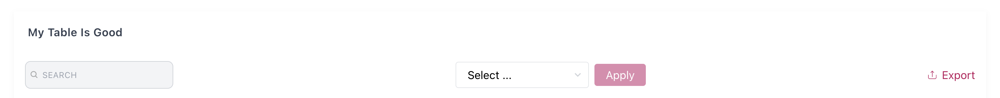
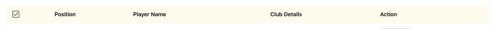
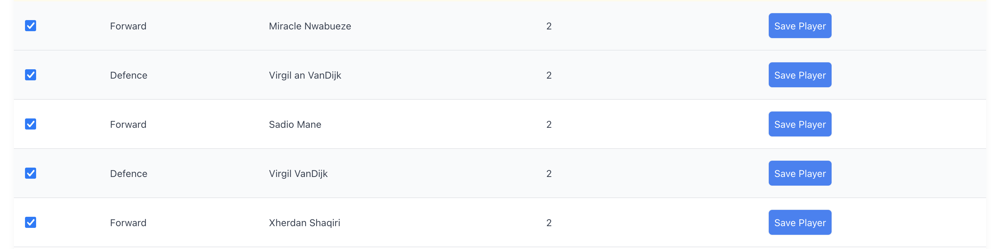
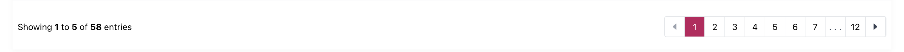
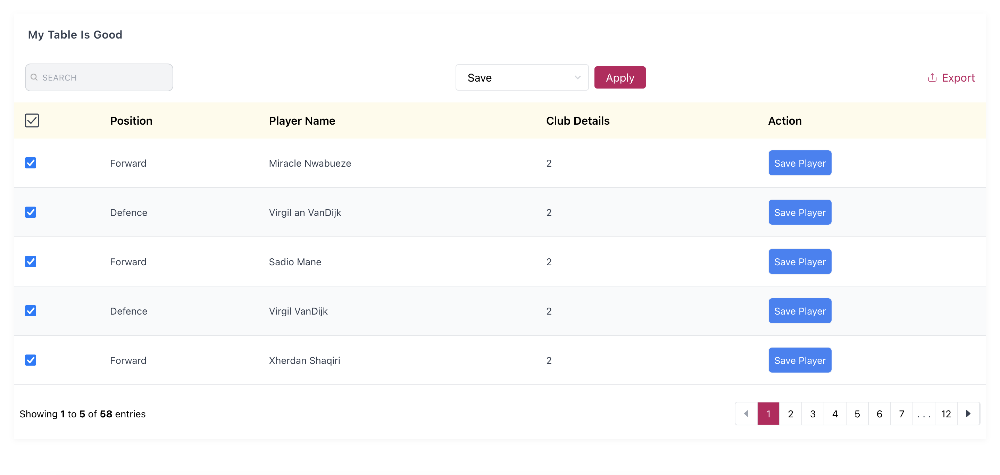

# react-tailwind-table

> A Responsive Table component Made with React Js and provides firstclass Tailwind CSS support. Perfectly works with any react application with or without Tailwind CSS. Comes with pagination, search, CSV export multi select and tons of other features.

[](https://www.npmjs.com/package/react-tailwind-table) 
[](https://standardjs.com)
[](https://github.com/semantic-release/semantic-release)


The core of the component is written in Typescript: Which brings alive the usage of `Typings` in this documentation. 
A few features that comes with this table include
-	1) 	Pagination
-	2)	Search
-	3)	Responsiveness
-	4)	CSV download
- 5)  Bulk Item Action
- 6)  Customizable table data display
- 7)  Full custom styling


> Contents

- [Installation](#install)
  - [Usage](#usage)
    - [Tailwind Project](#tailwind-project)
    - [None Tailwind Project](#none-tailwind-project)
- Set up:
  - [Table Props](#table-props)
  	- [Rows](#rows)
  	- [Columns](#columns)
    - [Rows Per Page](#rows-per-page)
    - [Table Header](#table-header)
  	- [Row Render (render function)](#row-render-render-function)
  	- [Debounced Search](#debounced-search),
    - [On Search Callback](#on-search-callback)
  	- [No Content Message](#no-content-message),
  	- [Hide Search](#hide-search)
    - [Should Export](#should-export)
    - [Export Text](#export-text)
    - [CSV Export File Name](#csv-export-file-name)
    - [Export Modify Function](#export-modify-function)
    - [Enable Bulk/Multiple Select](#enable-bulkmultiple-select)
    - [Bulk Action Button Text](#bulk-action-button)
    - [On Bulk Action](#on-bulk-action)
    - [Striped Table](#striped-table)
    - [Hover Indicator](#hover-indicator)
    - [Table With and Without Borders](#table-with-and-without-borders)
  - [Customization and Custom Styling](#customization-and-custom-styling)
  - [Using In Your Component](#using-in-your-component)
- [Looks and Feel](#looks-and-feel)
- [License](#license)

## Install

```bash
npm install --save react-tailwind-table
```

## Usage
This component also exports a tiny css file built by tailwind. All css classes used in designing and customizing the table component are all custom tailwind classes which ensures that an existing tailwind project would not need to include this css file again.

### Tailwind Project
A tailwind project would just need to import the react component using `import Table from 'react-tailwind-table'`

### None Tailwind Project
None tailwind users can import this component in any react project of choice, no matter if they are using a css library or not. This can easily be achieved with two lines of code.
`import Table from 'react-tailwind-table'` and `import 'react-tailwind-table/dist/index.css'`

```tsx
import React, { Component } from 'react'

import Table from 'react-tailwind-table';
import 'react-tailwind-table/dist/index.css';

class Example extends Component {
  render() {
    return <Table columns={[]} rows={[]} />
  }
}

//Using Function component 

function Mycomponent(){

  return <Table columns={[]} rows={[]} />
}
```


## Table Props

The data from the props determines what will be displayed. There are about 2 compulsory props and 6 non-compulsory prop.
The interface defining the expected props is below.

```ts
interface Iprop {
	rows: Irow[],
	columns: Icolumn[],
	per_page?: number, 
   table_header?: string,
	no_content_text?: string, 
	debounce_search?: number,
	show_search?: boolean,
	should_export?: boolean,
	export_text?: string,
	bulk_select_options?: string[],
	bulk_select_button_text ?: string,
	export_csv_file ?: string,
	striped ?: boolean,
	bordered ?: boolean,
	hovered?: boolean,

	row_render?: (row: Irow, col: Icolumn, display_value: string) => string,
	on_search?: (search_word: string, result?: Irow[] | []) => void,
	export_modify?: (row: Irow, col: Icolumn, display_value: string) => string,
	on_bulk_action?: (selected_option: string, selected: Irow[]) => void,

  //This will be discussed properly in the course of the documentation
	styling ?: ItableStyle
}
```

### Rows

The rows prop determine the number of table rows available in the `<tbody/>` tag. This must be an array and is enforced using reacts `prop-types`  "PropTypes.array.isRequired" props checker.

The expected data types is an array of objects, each object having `string` keys. A nested object can be read and displayed as far as the [column field description](#columns) has a dot(.) accessor. e.g - `front_end_position.name.fullname`

```ts

interface Irow {
	[key: string]: any
}

type Irows  = Irow[]

//The full data format can be
var rows:Irows  = [
{
      id: 1,
      name: "Sadio Mane",
      country_id: 3,
      club_id: 2,
      front_end_position:{
        name:{
        	full_name:"Forward",
        	short_code:"FW"
        },
        id:2
      }
},
{
      id: 3,
      name: "Virgil VanDijk",
      country_id: 30,
      club_id: 2,
      front_end_position:{
        name:{
        	full_name:"Defence",
        	short_code:"DF"
        },
        id:2
      }
}
]
```


### Columns

The "columns" props is an array of objects that determines the details of the table headers and also determines which data from the `rows` prop is shown in the table. 

The  `Icolumn` interface contains two important properties which are 
- use: This is the name to be used as the table head `<th/>` display name
- field: This property is a string used to read data from each [row object](#rows), It determines what will be diplayed for each table column. This can have a **dot(.) accessor description** to read nested row objects.

The interface defining the table is below.

```ts

interface Icolumn {
	//Used to get string data from the each row object
	field: string, //This field can have a full stop(.) will allow us to read further into nested objects

	//This will be used to display in the table heading.
	use: string, 

	//Indicates that of this column should be used to search (optional). defaults to true.
	use_in_search?: boolean,

	//Indicates If this property should be used displayed in the table header (optional). defaults to true.
	use_in_display?: boolean,

  //Indicates if this field can be exported on the CSV (optional) defaults to true.
  use_in_export?: boolean,
};

type Icolumns = Icolumn[]

/**
 * The Example rows above can have its column data looking thus.
 */

var columns:Icolumns = [
       {
        field: "front_end_position.name.full_name",
        use: "Position",
        //Will not be used in search filtering
        use_in_search:false
      },
      {
        field: "name",
        use: "Player Name",
      },
      {
        field: "country_id",
        use: "Country",

        //Will not be displayed in the table
        use_in_display: false
      },
      {
        field: "club_id",
        use: "Club Details",
        //would not be exported as a CSV column
        use_in_export: false

      }
  ]

```


### Rows Per Page 

This is a number type that indicates how many rows per page should be displayed. By default the value is set at `10`,
You can decrease or increase this value.


### Table Header

The table usually has a header which is set as an empty string, this can be set as a string alone.


### Row Render (render function)

A developer might want to customize the data displayed to a user, I really want him to have that power. I ensured that can happend by using [reacts render props](https://reactjs.org/docs/render-props.html) . 

Its abolutely optional but gets
- The current row object
- The current column object
- The supposed display property

See an example below.

```tsx

type Irender_row = (row: Irow, col: Icolumn,display_value:any) => JSX.Element | string;

class App extends React.Component {

  constructor(props) {
    super(props)
  }

rowcheck:Irender_row = (row,column, display_value) => {

    if (column.field === "club_id") {
      return <button className="border p-2">View Club Details</button>
    }

    if (column.field === "name") {
      return <b>{display_value}</b>
    }

    return display_value
  }

  render() {
    return <Table columns={columns} rows={rows} per_page={3} table_header="Test Table" row_render ={this.rowcheck}/>
  }
}
```


### Debounced Search

To have a unique search feature, I [debounced the users input](https://css-tricks.com/debouncing-throttling-explained-examples/), so as to trigger a search when there is no keyboard click for `300 milli seconds`. You can use the `debounce_search` prop to make it shorter or longer(must be in milli seconds).
To make the component fast and keep it smooth (Since a search goes through all rows: a high data application might have thousands of rows) I defeered the search into a non blocking promise. You can trust that your application performance will not be affected by this table component.


### On Search Callback

Having a full grasp of all that is happening inside the table component can be very helpful in order to aid debugging and also know user behavior. The search field can fire events as user go ahead to filter through the table. Pass a function to the `on_search` prop. The definition is thus
```ts
type searchCallback = (search_word: string, result?: Irow[] | []) => void
```

### No Content Message

When there is no data to display (rows props is empty), the `No Data Availaible` text is shown. The `no_content_text` props controls the text.


### Hide Search

By default, the search input form is visible, to hide it, pass a `false` to the `show_search` prop.


### Should Export

The CSV download is enabled by default, this behaviour can be turned off by passing a `false` to the  `should_export` prop.

### Export Text

The text for CSV download button defaults to `Export`, this can be changed using the  `export_text` prop.


### CSV Export File Name

Downloaded CSV file will always have a name. This defaults to `download.csv`, change this name by passing a string to the `export_csv_file` prop. This would be suffixed with the **.csv** expension during download.


### Export Modify Function

You might want to make some final touch to each row data that gets displayed on the CSV. This function will be invoked with the current [column](#columns) and [row](#rows) and actual value to be displayed on the CSV cell. It's type is defined below.

```ts
export type stringRenderFunc = (row: Irow, col: Icolumn, display_value: string) => string;
```


### Enable Bulk/Multiple Select

To show the multi select input means you have a desire to take action due to the multiple selected data on on the table. this will be possible if a non-empty string array is passed into the `bulk_select_options` props. E.g ->
```jsx
<Table columns={col} rows={rows}  bulk_select_options={["Save","Delete","Update"]} />
```

### Bulk Action Button

The button that allows action to be taken for multi selected items has a default text of `Apply`. this can be changed using the `bulk_select_button_text` prop.


### On Bulk Action

When a user has selected multiple items and clicks away on the Apply button, this callback function will be invoked with two parameters which are 
1. The option selected from the dropdown.
2. An array of rows selected on the table.
```ts
type callback = (selected_option: string, selected: Irow[]) => void,
```


### Striped Table

Borrowing a concept from boostrap tables: To have the table with a striped bg-gray-50 at even rows, pass a boolean value to the `striped` prop. It defaults to `true`.


### Hover Indicator

A `bg-gray-50` color can be applied on a row when the mouse hovered over it. Control this by passing a boolean to the `hovered` prop. It defaults to `true`.


### Table With and Without Borders

The borders of a the table can be controlled with the `bordered` prop. 


## Customization and Custom Styling

Quite a number of request came for this feature and I also saw the need to allow users thinker around how they use design, re-design and use the component to their taste.

The table is broken down into 4 major sections which are

* Table Top 

* Table Head 

* Table Body 

* Table Footer 

To customize any section of this 4 parts, the `styling` props takes quite a large object that can help you customize fully.

> **NOTE** these customizations happens by appending your self defined class into each section of the table. So in case your desired effect does not take place, you can super-impose by adding a `!inmportant` in your class declaration. The `base_bg_color` and  `base_text_color` color below controls the current coloring of the table.

```ts
interface ItableStyle {
	base_bg_color?: string, //defaults to  bg-pink-700
	base_text_color?: string,//defaults to text-pink-700
	main?: string, //The container holding the table
	top?: {
    title?: string,
    elements?: { // The elements include the search, bulk select and csv download components
      main?: string, //The row holding these components
      search?: string,
      bulk_select?: {
        main?: string, // styling targets the dropdown
        button?: string
      },
      export?: string
    }
  },
	table_head?: {
		table_row?: string, // The <tr/> holding all <th/>
		table_data?: string // each table head column
	},
	table_body?: {
		main?: string, //main here targets <tbody/>
		table_row?: string,
		table_data?: string
	},
	footer?: {
		main?: string, // row holding the footer
		statistics?:{ // those shiny numbers like **Showing 1 to 5 of 58 entries**
			main ?: string,
			bold_numbers ?: string //The numbers like 1, 5, 58
		},
		page_numbers?: string //the number boxes
	}
}
```

## Using In Your Component

 Setting up the table component is the easiest thing ever 😀 .The example below is found in our [examples folder](example)
 
```tsx

import React from 'react'
import Table from 'react-tailwind-table'
import 'react-tailwind-table/dist/index.css' //use for a non tailwind project


class App extends React.Component {

  constructor(props) {
    super(props)

    this.state={
      columns:column(),
      rows: fakePlayers()
    }
  }


  rowcheck = (row,column, display_value) => {

    if (column.field === "created_at") {
      return <button className="border p-2">See button</button>
    }

    if (column.field === "name") {
      return <b>{display_value}</b>
    }

    return display_value
  }

  render() {
    return <Table columns={this.state.columns} rows={this.state.rows} per_page={3} table_header="Test Table" row_render ={this.rowcheck}/>
  }
}

function column() {
    return [
      {
        field: "front_end_position.name",
        use: "Position"
      },
      {
        // use_in_display: false,
        field: "name", //Object destructure
        use: "Name"
      },

      {
        field: "created_at",
        use: "Action",
        // use_in_search:false
      }]
}

function fakePlayers(){

    return [{
      id: 1,
      name: "Sadio Mane",
      country_id: 3,
      club_id: 2,
      position_id: 1,
      shirt_number: "10",
      created_by: 2,
      deleted_at: null,
      created_at: "12/12/12 15:00:00",
      updated_at: "12/12/12 15:00:00",
      is_defender: false,
      is_midfielder: false,
      is_forward: true,
      is_goalkeeper: false,
      front_end_position:{
        name:"attach",
        id:2
      }
    },
    {
      id: 2,
      name: "Mohammed Sala",
      country_id: 3,
      club_id: 2,
      position_id: 1,
      shirt_number: "11",
      created_by: 2,
      deleted_at: null,
      created_at: "12/12/12 15:00:00",
      updated_at: "12/12/12 15:00:00",
      is_defender: false,
      is_midfielder: false,
      is_forward: true,
      is_goalkeeper: false,
      front_end_position:{
        name:"Forward",
        id:4
      }
    },
    {
      id: 3,
      name: "Robertor Fermino",
      country_id: 3,
      club_id: 2,
      position_id: 1,
      shirt_number: "8",
      created_by: 2,
      deleted_at: null,
      created_at: "12/12/12 15:00:00",
      updated_at: "12/12/12 15:00:00",
      is_defender: false,
      is_midfielder: false,
      is_forward: true,
      is_goalkeeper: false,
      front_end_position:{
        name:"Defence",
        id:9
      }
    }];
  }


  export default App

```


## Looks and Feel




## License

MIT © [mklef121](https://github.com/mklef121)
