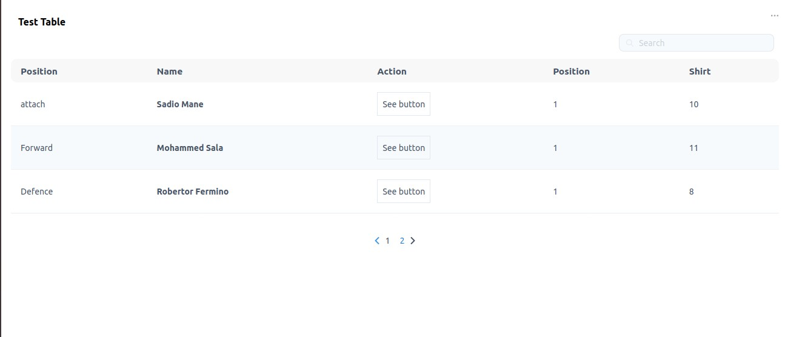

# react-tailwind-table

> A Responsive Table component Made with React js and Tailwind Css. Has Pagination and search ability.

[](https://www.npmjs.com/package/react-tailwind-table) 
[](https://standardjs.com)
[](https://github.com/semantic-release/semantic-release)


The core of the component is written in Typescript: Which brings alive the usage of `Typings` in this documentation. 
A few features that comes with this table include
-	1) 	Pagination
-	2)	Search
-	3)	Responsiveness
-	4)	Customizable table data display


> Contents

- [Installation](#install)
  - [Usage](#usage)
- Set up:
  - [Table Props](#table-props)
  	- [Rows](#rows)
  	- [Columns](#columns)
  	- [Row Render (render function)](#row-render-render-function)
  	- [Rows Per Page](#row-per-page)
  	- [Table Header](#table-header)
  	- [Debounce Search](#debounce-search),
  	- [No Content Message](#no-content-message),
  	- [Hide Search](#hide-search)
  - [Using In Your Component](#using-in-your-component)
- [Looks and Feel](#looks-and-feel)
- License

## Install

```bash
npm install --save react-tailwind-table
```

## Usage

```tsx
import React, { Component } from 'react'

import Table from 'react-tailwind-table'
import 'react-tailwind-table/dist/index.css'

class Example extends Component {
  render() {
    return <Table columns={[]} rows={[]} />
  }
}
```


## Table Props

The data from the props determines what will be displayed. There are about 2 compulsory props and 6 non-compulsory prop.
The interface defining the expected props is below.

```ts
interface Iprop {
	rows: Irow[],
	columns: Icolumn[],
	row_render?: (row: Irow, col: Icolumn,display_value:string) => JSX.Element | string,
	per_page?: number,
	no_content_text?: string,
	debounce_search?: number,
	table_header?:string,
	show_search?:boolean
}
```

### Rows

The rows prop determine the number of table rows available in the `<tbody/>` tag. This must be an array and is enforced using reacts `prop-types`  "PropTypes.array.isRequired" props checker.

The expected data types is an array of objects, each object having `string` keys.

```ts

interface Irow {
	[key: string]: any
}

type Irows  = Irow[]

//The full data format can be
var rows:Irows  = [
{
      id: 1,
      name: "Sadio Mane",
      country_id: 3,
      club_id: 2,
      front_end_position:{
        name:{
        	full_name:"Forward",
        	short_code:"FW"
        },
        id:2
      }
},
{
      id: 3,
      name: "Virgil VanDijk",
      country_id: 30,
      club_id: 2,
      front_end_position:{
        name:{
        	full_name:"Defence",
        	short_code:"DF"
        },
        id:2
      }
}
]
```


### Columns

The "columns" props is an array of objects that determines the details of the table headers and also determines which data from the `rows` prop is shown in the table. 

The  `Icolumn` interface contains two important properties which are 
- use: This is the name to be used as the table head `<th/>` display name
- field: This property is a string used to read data from each `row object`, It determines what will be diplayed for each table column

The interface defining the table is below.

```ts

interface Icolumn {
	//Used to get string data from the each row object
	field: string, //This field can have a full stop(.) will allow us to read further into nested objects

	//This will be used to display in the table heading
	use: string, 

	//Indicates that of this column should be used to search (optional)
	use_in_search?: boolean,

	//Indicates If this property should be used displayed in the table header (optional)
	use_in_display?: boolean,
};

type Icolumns = Icolumn[]

/**
 * The Example rows above can have its column data looking thus.
 */

var columns:Icolumns = [
       {
        field: "front_end_position.name.full_name",
        use: "Position",
        //Will not be used in search filtering
        use_in_search:false
      },
      {
        field: "name",
        use: "Player Name",
      },
      {
        field: "country_id",
        use: "Country",

        //Will not be displayed in the table
        use_in_display: false
      },
      {
        field: "club_id",
        use: "Club Details",

      }
      ]

```


### Row Render (render function)

A developer might want to customize the data displayed to a user, I really want him to have that power. I ensured that can happend by using [reacts render props](https://reactjs.org/docs/render-props.html) . 

Its abolutely optional but gets
- The current row object
- The current column object
- The supposed display property

See an example below.

```tsx

type Irender_row = (row: Irow, col: Icolumn,display_value:any) => JSX.Element | string;

class App extends React.Component {

  constructor(props) {
    super(props)
  }

rowcheck:Irender_row = (row,column, display_text) => {

    if (column.field === "club_id") {
      return <button className="border p-2">View Club Details</button>
    }

    if (column.field === "name") {
      return <b>{display_text}</b>
    }

    return display_text
  }

  render() {
    return <Table columns={columns} rows={rows} per_page={3} table_header="Test Table" row_render ={this.rowcheck}/>
  }
}
```


### Rows Per Page 

This is a number type that indicates how many rows per page should be displayed. By default the value is set at `10`,
You can decrease or increase this value.


### Table Header

The table usually has a header which is set as an empty string, this can be set as a string alone.

### Debounce Search

To have a unique search feature, I [debounced the users input](https://css-tricks.com/debouncing-throttling-explained-examples/), so as to trigger a search when there is no keyboard click for `300 milli seconds`. You can use the `debounce_search` prop to make it shorter or longer(must be in milli seconds).
To make the component fast and keep it smooth (Since a search goes through all rows: a high data application might have thousands of rows) I defeered the search into a non blocking promise. You can trust that your application performance will not be affected by this table component.


### No Content Message
table_header

When there is no data to display (rows props is empty), the `No Data Availaible` text is shown. The `no_content_text` props controls the text.

### Hide Search

By default, the search input form is vissible, to hide it, pass a `false` to the  `show_search` prop.


## Using In Your Component

 Setting up the table component is the easiest thing ever 😀 .The example below is found in our [examples folder](example)

```tsx

import React from 'react'
import Table from 'react-tailwind-table'
import 'react-tailwind-table/dist/index.css'


class App extends React.Component {

  constructor(props) {
    super(props)

    this.state={
      columns:column(),
      rows: fakePlayers()
    }
  }


  rowcheck = (row,column, display_text) => {

    if (column.field === "created_at") {
      return <button className="border p-2">See button</button>
    }

    if (column.field === "name") {
      return <b>{display_text}</b>
    }

    return display_text
  }

  render() {
    return <Table columns={this.state.columns} rows={this.state.rows} per_page={3} table_header="Test Table" row_render ={this.rowcheck}/>
  }
}

function column() {
    return [
      {
        field: "front_end_position.name",
        use: "Position"
      },
      {
        // use_in_display: false,
        field: "name", //Object destructure
        use: "Name"
      },

      {
        field: "created_at",
        use: "Action",
        // use_in_search:false
      }]
}

function fakePlayers(){

    return [{
      id: 1,
      name: "Sadio Mane",
      country_id: 3,
      club_id: 2,
      position_id: 1,
      shirt_number: "10",
      created_by: 2,
      deleted_at: null,
      created_at: "12/12/12 15:00:00",
      updated_at: "12/12/12 15:00:00",
      is_defender: false,
      is_midfielder: false,
      is_forward: true,
      is_goalkeeper: false,
      front_end_position:{
        name:"attach",
        id:2
      }
    },
    {
      id: 2,
      name: "Mohammed Sala",
      country_id: 3,
      club_id: 2,
      position_id: 1,
      shirt_number: "11",
      created_by: 2,
      deleted_at: null,
      created_at: "12/12/12 15:00:00",
      updated_at: "12/12/12 15:00:00",
      is_defender: false,
      is_midfielder: false,
      is_forward: true,
      is_goalkeeper: false,
      front_end_position:{
        name:"Forward",
        id:4
      }
    },
    {
      id: 3,
      name: "Robertor Fermino",
      country_id: 3,
      club_id: 2,
      position_id: 1,
      shirt_number: "8",
      created_by: 2,
      deleted_at: null,
      created_at: "12/12/12 15:00:00",
      updated_at: "12/12/12 15:00:00",
      is_defender: false,
      is_midfielder: false,
      is_forward: true,
      is_goalkeeper: false,
      front_end_position:{
        name:"Defence",
        id:9
      }
    }];
  }


  export default App

```


##Looks and Feel




## License

MIT © [mklef121](https://github.com/mklef121)
